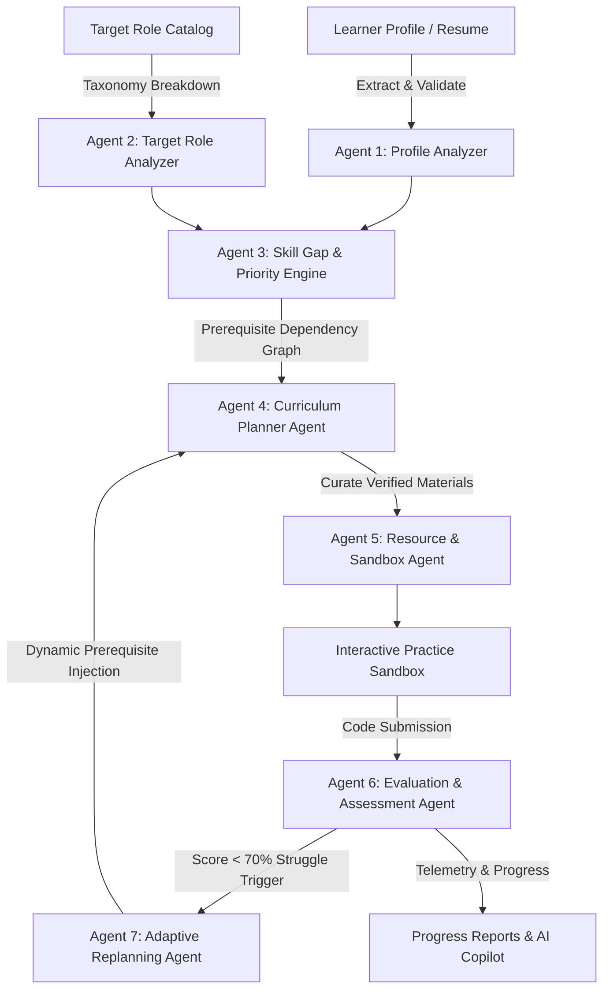

# 🧭 EduPath AI — Autonomous Multi-Agent Personalized Learning & Adaptive Upskilling Platform

[](https://edupath-nu-blush.vercel.app/)
[](https://github.com/pavankarthikeyaatchyuta-lab/EduPath)
[](https://edupath-nu-blush.vercel.app/)
[](https://react.dev/)
[](https://fastapi.tiangolo.com/)

> **Agentic AI Hackathon 2026 — Problem Statement 1: Personalized Learning & Skill Gap Agent**  
> *Transforming static, one-size-fits-all curricula into an autonomous, closed-loop adaptive learning engine that diagnoses gaps, constructs evidence-backed dependency roadmaps, and dynamically restructures in real-time as you learn.*

---

## 🚀 Live Deployment
- **Production URL:** [https://edupath-nu-blush.vercel.app/](https://edupath-nu-blush.vercel.app/)
- **Built-in Demo Profile:** Alex Rivera (Junior AI Developer $\rightarrow$ Aspiring Generative AI Engineer)
- **Zero-Setup Quickstart:** Click **"Launch 3-Minute Demo"** on the landing page to explore all multi-agent features instantly without manual input.

---

## 🎯 The Core Problem

Traditional online learning platforms and bootcamps suffer from three fundamental flaws:
1. **One-Size-Fits-All Syllabi:** Advanced developers are forced to sit through basic syntax tutorials, while beginners are overwhelmed by complex architectural concepts without required prerequisites.
2. **Static & Fragile Roadmaps:** Once a learning path is generated, it never changes. When a learner struggles on a foundational topic (e.g., token chunking or vector similarity), the curriculum blindly pushes them into advanced topics (multi-agent orchestration).
3. **Disconnected Evaluation:** Multiple choice quizzes test trivia rather than applied engineering competencies, offering zero automated remediation or curriculum self-healing.

---

## 💡 The EduPath Solution: 7-Agent Autonomous Architecture

EduPath AI solves this by deploying a coordinated swarm of specialized AI agents running on a closed-loop feedback pipeline:



### 🤖 The Agent Swarm Breakdown

| # | Agent Name | Primary Responsibility | Key Output |
|---|---|---|---|
| **1** | **Profile Analyzer** | Ingests resumes, text inputs, and GitHub/project evidence to classify skills into `demonstrated`, `inferred`, and `unknown` with probabilistic confidence scores (0.0–1.0). | Evidence-backed capability vector |
| **2** | **Target Role Analyzer** | Deconstructs modern engineering roles into hierarchical competency trees with strict prerequisite relations. | 13 Requisite Capabilities & Minimum Proficiency Targets |
| **3** | **Skill Gap & Priority Engine** | Computes deficiency deltas between current proficiencies and role requirements. Calculates urgency vs. impact priority scores. | Weighted skill gap matrix & critical priorities |
| **4** | **Dynamic Planner Agent** | Schedules a weekly paced learning roadmap balancing weekly hours, difficulty slopes, and cognitive load limits. | Versioned 4-week structured curriculum |
| **5** | **Resource & Sandbox Curator** | Enriches each activity with verified technical documentation, research papers, and interactive coding challenges. | Curated resources & sandbox prompts |
| **6** | **Evaluation & Assessment Agent** | Grades coding submissions against multi-criteria rubrics, providing score labels, explicit strengths, weaknesses, and primary failure modes. | Multi-dimensional rubric score & feedback |
| **7** | **Closed-Loop Adaptive Replanning Agent** | Monitors assessment telemetry. If score falls below mastery threshold (<70%), it automatically injects prerequisite micro-drills and reschedules downstream tasks. | Versioned Roadmap Diff (`v1 -> v2`) & explanation |

---

## ✨ Key Features & Walkthrough

### 1. 3-Minute Deterministic Demo Mode
- Instant evaluation of the platform using **Alex Rivera**'s profile:
  - **Current Role:** Junior AI Developer (Proficient in Python, FastAPI, SQL).
  - **Target Role:** Generative AI Engineer.
  - **Pre-computed Baseline:** 68% role match with 5 identified critical gaps (*RAG, AI Evaluation, Vector DBs, MLOps, Agentic AI*).

### 2. Evidence-Based Skill Classification
- Distinguishes between what a learner has actually built (`demonstrated` from resume/projects), what is logically derived (`inferred`), and what is unproven (`unknown`).
- Full transparency: click any skill to view direct evidence citations and confidence metrics.

### 3. Interactive Practice Sandbox & Automated Evaluation
- Hands-on coding challenge: *“Implement Production-Ready Recursive Token Chunking with Metadata”*.
- Submit code directly in the sandbox to receive instant automated evaluation across:
  - Character/token budget adherence
  - Sentence boundary preservation
  - Overlap offset accuracy
  - Error and edge case resilience

### 4. Demonstrable Closed-Loop Curriculum Adaptation
- When a submission exposes a foundational weakness (e.g., scoring **58/100** due to mid-sentence clipping), the **Adaptive Replanning Agent** fires:
  - Generates **Roadmap Version 2 (v2)**.
  - Inserts *“⚡ Prerequisite Drill: Sentence Boundary Preservation in Document Chunking”* into Week 1.
  - Adjusts scheduling for downstream topics to prevent cumulative cognitive debt.
  - Explains the exact reason for the change in the **Adaptive Diff Modal**.

### 5. AI Career Copilot
- Context-aware conversational assistant aware of your specific skill gaps, roadmap milestones, and current practice task.
- Ask questions like:
  - *"Why is RAG prioritized before Multi-Agent systems?"*
  - *"What are the core metrics of the RAG Triad?"*
  - *"What should I focus on today?"*

### 6. Hackathon Build Story Modal
- Interactive modal documenting the 2-day hackathon engineering sprint:
  - **Day 1:** Multi-agent dependency modeling, extraction pipeline, and evaluation sandbox.
  - **Day 2:** Closed-loop replanning triggers, UI polishing, resilience fallbacks, and Vercel serverless deployment.
  - Ready-to-share LinkedIn project announcements.

---

## 🛠️ Technology Stack

### Frontend
- **Framework:** React 19 with Vite 8
- **Language:** TypeScript 6
- **Styling:** Tailwind CSS v4 (Modern CSS theme, dark-mode native, responsive grid layouts)
- **Icons:** Lucide React
- **Architecture:** Resilient Client Fallback Engine (graceful offline/cold-start operation)

### Backend
- **Framework:** FastAPI (ASGI)
- **Language:** Python 3.12+
- **Validation:** Pydantic v2
- **Database:** SQLite with WAL (Write-Ahead Logging) mode and `/tmp` serverless persistence
- **Document Processing:** `pypdf` for resume PDF text extraction
- **LLM Integration:** Google Gemini API (`gemini-3.6-flash` / Gemini 2.5) with local fallback orchestrator

### Infrastructure & Deployment
- **Hosting:** Vercel Serverless Functions + Single Page Application (SPA)
- **CI/CD:** Automated GitHub branch deployment integration
- **Monorepo Structure:** Unified repository with npm workspaces and Python serverless API

---

## 📁 Repository Directory Structure

```
EduPath/
├── api/                             # Vercel Serverless Python Function
│   ├── index.py                     # Serverless entrypoint & error handler
│   ├── requirements.txt             # Serverless Python dependencies
│   └── app/                         # Packaged backend agent modules
│       ├── agents/                  # 7 specialized AI agent definitions
│       ├── demo/                    # Deterministic demo dataset (Alex Rivera)
│       ├── document_processing/     # Resume PDF text extractors
│       ├── ai_provider.py           # Multi-provider LLM client (Gemini/Groq/Mock)
│       ├── config.py                # Environment & path management
│       ├── database.py              # SQLite connection & schema definitions
│       └── main.py                  # FastAPI route controllers
├── backend/                         # Local FastAPI development server
│   ├── app/                         # Source backend application
│   └── requirements.txt             # Full backend dependencies
├── frontend/                        # React 19 + TypeScript + Vite SPA
│   ├── src/
│   │   ├── components/              # UI components (Dashboard, Sandbox, Copilot, etc.)
│   │   ├── services/
│   │   │   ├── api.ts               # HTTP client with resilient fallback handling
│   │   │   └── mockData.ts          # Complete offline/serverless fallback dataset
│   │   ├── types/                   # Unified TypeScript domain interfaces
│   │   ├── App.tsx                  # Root navigation & application shell
│   │   └── main.tsx                 # Entrypoint
│   ├── package.json                 # Frontend dependencies
│   └── vite.config.ts               # Vite bundler configuration
├── package.json                     # Root npm workspace configuration
├── requirements.txt                 # Project-level Python dependencies
├── vercel.json                      # Vercel routing, build command & SPA rewrites
└── README.md                        # Documentation
```

---

## ⚡ Quickstart & Local Development

### Prerequisites
- Node.js 20+ and npm 10+
- Python 3.11+
- *(Optional)* Gemini API Key (get one from [Google AI Studio](https://aistudio.google.com/))

### 1. Clone the Repository
```bash
git clone https://github.com/pavankarthikeyaatchyuta-lab/EduPath.git
cd EduPath
```

### 2. Backend Setup
```bash
cd backend
python -m venv venv

# On Windows:
.\venv\Scripts\activate
# On macOS/Linux:
source venv/bin/activate

pip install -r requirements.txt

# Create .env file
copy .env.example .env   # (or cp .env.example .env on Linux/macOS)
# Add your GEMINI_API_KEY to .env

# Run FastAPI backend
uvicorn app.main:app --reload --port 8000
```
API will be live at: `http://localhost:8000` (Swagger docs at `http://localhost:8000/docs`).

### 3. Frontend Setup
In a new terminal window:
```bash
cd frontend
npm install
npm run dev
```
Web application will be live at: `http://localhost:5173`.

---

## 🔑 Environment Variables

Create a `.env` file in the project root or in `backend/`:

```env
# Google Gemini API Key (Optional: App includes deterministic fallback agents)
GEMINI_API_KEY=your_gemini_api_key_here

# LLM Provider Configuration
LLM_PROVIDER=auto               # Options: auto, gemini, groq, mock
LLM_MODEL=gemini-3.6-flash

# SQLite Database Location
EDUPATH_DB_PATH=edupath.db
```

---

## 📡 API Endpoints Overview

| Method | Endpoint | Description |
|---|---|---|
| `GET` | `/api/health` | Service health check and LLM configuration status |
| `POST` | `/api/demo/init` | Resets and seeds Alex Rivera's deterministic profile |
| `GET` | `/api/roles` | Lists predefined engineering roles and competencies |
| `POST` | `/api/profile/create` | Runs 5-agent pipeline to parse profile & generate roadmap |
| `POST` | `/api/profile/upload-resume`| Extracts skills and work experience from PDF resume |
| `GET` | `/api/dashboard/{user_id}` | Fetches user summary, skills, top gaps, and next action |
| `GET` | `/api/roadmap/{user_id}` | Retrieves versioned weekly roadmap with activities |
| `GET` | `/api/roadmap/{user_id}/versions` | Lists historical versions generated by replanning agent |
| `PATCH` | `/api/activity/{id}/status` | Updates activity state (`pending`, `in_progress`, `completed`)|
| `GET` | `/api/practice/{user_id}` | Retrieves tailored coding sandbox challenge |
| `POST` | `/api/practice/{user_id}/submit`| Evaluates submission and triggers adaptive replanning |
| `POST` | `/api/copilot/{user_id}` | Queries conversational context-aware AI tutor |
| `GET` | `/api/agent-logs/{user_id}` | Inspects real-time multi-agent activity stream |
| `GET` | `/api/reports/{user_id}` | Generates periodic learning progress report |

---

## 🏆 Hackathon Evaluation Criteria Alignment

| Criteria | How EduPath AI Delivers |
|---|---|
| **Autonomous Multi-Agent Collaboration** | 7 specialized agents communicating across profile analysis, taxonomy mapping, gap identification, curriculum planning, resource curation, rubric evaluation, and adaptive replanning. |
| **Closed-Loop Feedback** | Learner struggles actively rewrite future curriculum versions (`v1 -> v2`) rather than delivering static pass/fail verdicts. |
| **Evidence Transparency** | Every skill classifies citations (`demonstrated` vs `inferred` vs `unknown`) with concrete resume/project anchors. |
| **Production Readiness** | Full-stack deployment on Vercel with resilient client-side fallbacks, SQLite WAL persistence, clean typing, and zero runtime crashes. |
| **UI/UX Polish** | Cyberpunk-inspired dark theme, animated progress indicators, version-switch diff visualizations, and mobile-responsive layout. |

---

## 📄 License
Distributed under the **MIT License**. See `LICENSE` for more information.

---

## 👨‍💻 Author & Acknowledgements
- **Author:** Pavan Karthikeya A.
- **Repository:** [https://github.com/pavankarthikeyaatchyuta-lab/EduPath](https://github.com/pavankarthikeyaatchyuta-lab/EduPath)
- Developed for **Agentic AI Hackathon 2026**.